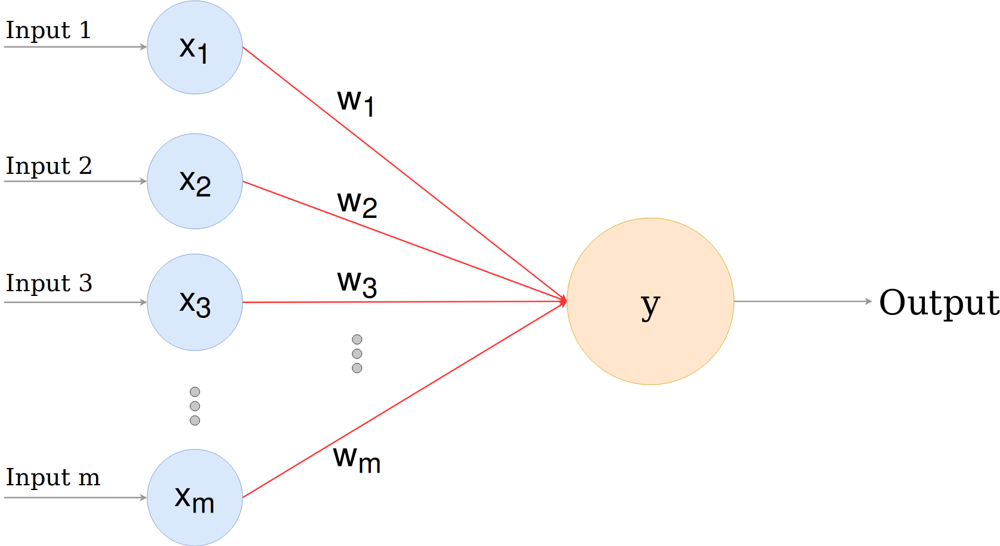

# Perceptron



Este repositório contém todo o código-fonte do texto do Medium sobre Perceptron.

## Instalação

1. Baixe ou clone o repositório.
2. Baixe e instale o [Miniconda](https://conda.io/miniconda.html). (__Windows__: marque a opção de adicionar o conda às variáveis de ambiente (_$PATH_))
3. Abra o terminal e digite o seguinte comando para instalar o ambiente:
    ```sh
    $ conda create -n perceptron python=3.8.2 numpy=1.18.1 pandas=1.0.3 matplotlib=3.1.3 scikit-learn=0.22.1 jupyter=1.0.0
    ```

## Uso do Ambiente

> __Nota:  É obrigatório seguir as ordens da seção "Instalação" antes de utilizar o ambiente__.

Siga os passos abaixo sempre que quiser executar os códigos desse repositório.
1. Abra o terminal e digite:

    - __Windows__:
    ```sh
    $ activate perceptron
    ```
    - __Linux/Mac__:
    ```sh
    $ source activate perceptron
    ```
2. Execute o Jupyter Notebook:
    ```sh
    $ jupyter notebook
    ```

